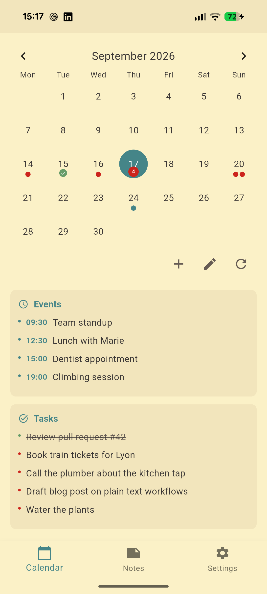
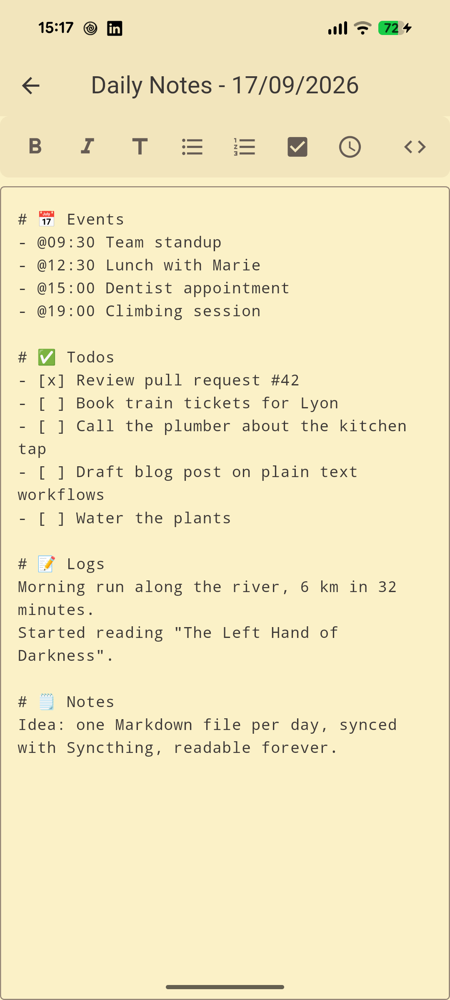
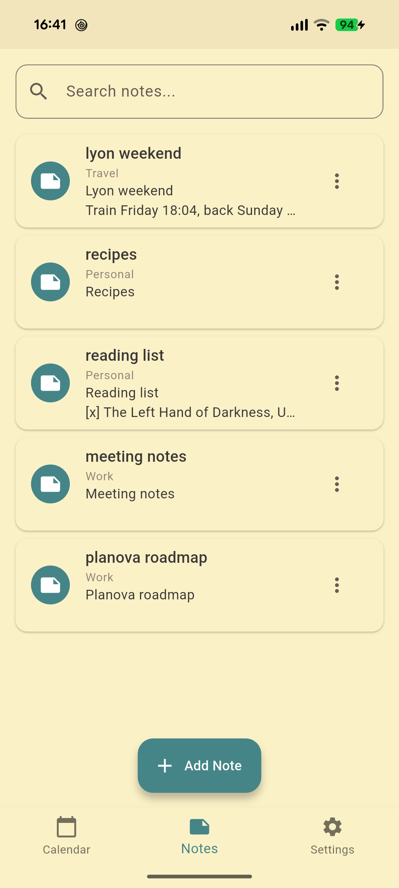
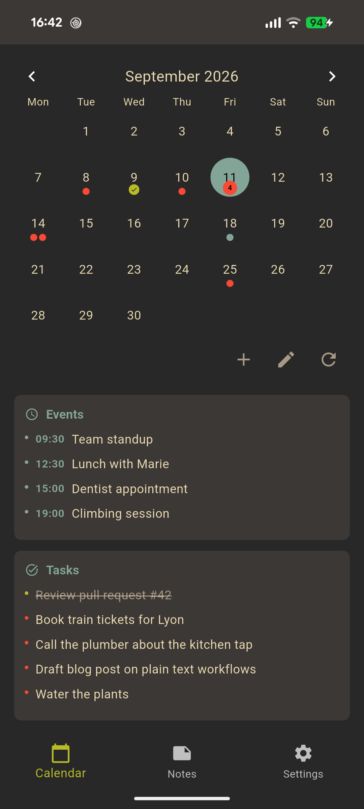
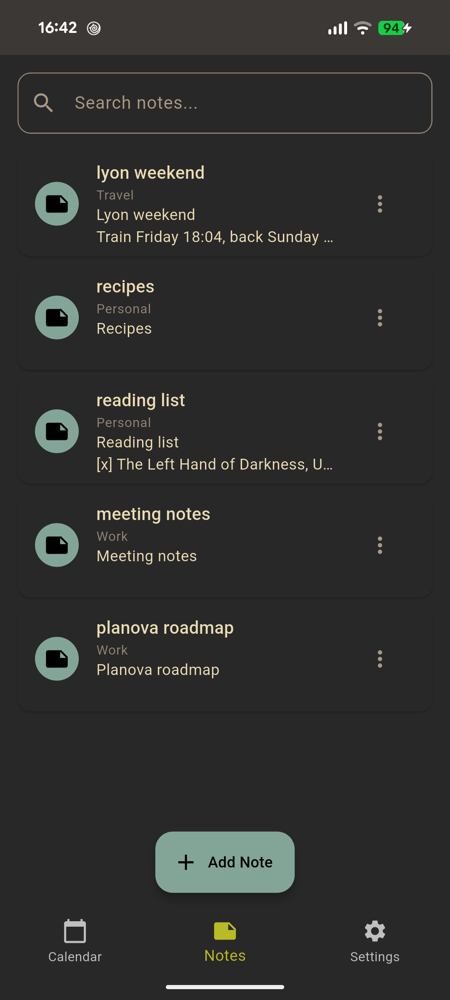
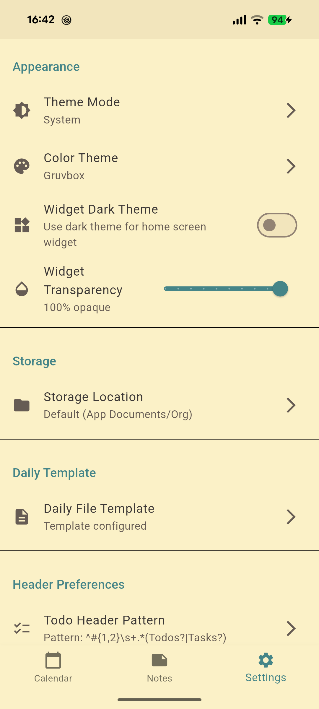

# PlaneTxt

Todo, agenda, journal and notes in plain Markdown files.

PlaneTxt is an opinionated, future-proof app to manage your life in plain text. Everything lives in a folder you own: one Markdown file per day for your events, todos and journal, plus a tree of notes. There is no database, no account, no network access. Sync the folder with Syncthing, Dropbox or anything else, and open the files with any editor.

PlaneTxt (formerly Planova) is the successor of MOrg: it replaces the calendar.txt and todo.txt pair with structured dailies that are easier to scale, search and sync.

<p align="center">
  
  
  
</p>
<p align="center">
  
  
  
</p>

## Features

- **Calendar view**: a month calendar with the events and tasks of the selected day below it. Days with content show colored markers.
- **Daily files**: each day is a Markdown file with Events, Todos, Logs and Notes sections. The template is configurable.
- **Todos**: check and uncheck with a double tap. Refill carries unfinished todos from any previous day over to today.
- **Events**: `- @09:30 Team standup` becomes a timed event, with a notification one hour before it starts.
- **Quick add**: add an event or a todo to a day without opening the editor.
- **Notes**: a searchable list of notes organized in subfolders, with rename and delete.
- **Markdown editor**: formatting toolbar, auto-indent and todo handling.
- **ICS import**: share an .ics file to PlaneTxt to merge its events into the right days.
- **Home screen widget** (Android): today's events and todos, with light and dark styles and adjustable transparency.
- **Themes**: system, light or dark mode, with Gruvbox, Nord, Adwaita, Monokai and Everforest color themes.
- **Your storage, your rules**: keep the default app folder or pick any folder through the system picker. No storage permission is needed.
- **External edits are safe**: files changed by another tool are picked up, writes are atomic, and nothing is overwritten silently.

## Omarchy shell plugin

On Linux, the same folder can drive your desktop bar. [PlaneTxtQuickShell](https://github.com/brvier/PlaneTxtQuickShell) is an [Omarchy](https://omarchy.org) 4 shell plugin that replaces the date and time widget with a PlaneTxt-backed panel. The clock stays, with a badge counting today's undone todos. Clicking it opens a calendar with per-day indicators, the selected day's events, tasks and notes, quick add, refill, and a notes browser. Point it at the folder you sync from the phone and both stay in step.

## File structure

```
Org/
├── dailies/
│   ├── 20260910.md
│   └── 20260911.md
├── archives/
└── notes/
    ├── Work/
    │   └── project.md
    └── Personal/
        └── reading_list.md
```

A daily file looks like this:

```markdown
# 📅 Events
- @09:30 Team standup
- @15:00 Dentist appointment

# ✅ Todos
- [x] Review pull request #42
- [ ] Book train tickets for Lyon

# 📝 Logs
Morning run along the river, 6 km.

# 🗒️ Notes
Idea: one Markdown file per day, readable forever.
```

The section headers are matched by configurable patterns, so you can rename them.

## Install

- **Android**: APKs are attached to each [GitHub release](https://github.com/brvier/PlaneTxtFlutter/releases). Play Store and F-Droid listings are in progress.
- **Linux**: build from source, see below. Desktop entries are provided in `planetxt.desktop` and `planetxt-portable.desktop`. Omarchy users can also install the [PlaneTxtQuickShell](https://github.com/brvier/PlaneTxtQuickShell) bar plugin.
- **iOS, macOS, Windows, web**: the Flutter project builds for these targets, but they are not tested regularly.

## Build from source

Requires the Flutter SDK (3.44 or newer) and, for Android, a JDK 17 or 21.

```
flutter pub get
flutter run                         # debug build on the connected device
flutter build apk --split-per-abi   # Android release APKs
flutter build linux                 # Linux desktop
flutter test                        # unit tests
```

Release builds are signed with the key described in `android/key.properties`, and fall back to the debug key when that file is absent.

## Roadmap

Done:

- [x] Month calendar with the selected day's content below it
- [x] Editable dailies with todo check and uncheck
- [x] Refill of undone todos
- [x] Notes view with folders, search and rename
- [x] Quick-add modal for events and todos
- [x] Preferences: theme mode, color themes, storage folder, daily template, header patterns
- [x] Event notifications
- [x] Android home screen widget
- [x] ICS import through the Android share sheet
- [x] Custom storage folder through the system picker, no storage permission
- [x] Linux desktop build
- [x] Unit tests and CI

Next:

- [ ] F-Droid and IzzyOnDroid listings
- [ ] Share a note from the notes view
- [ ] Archive a note
- [ ] Fold and unfold note subfolders
- [ ] Receive shared text as a new note or todo
- [ ] Weekly review screen
- [ ] Desktop layout for wide screens

## Contributing

Issues and pull requests are welcome on [GitHub](https://github.com/brvier/PlaneTxtFlutter). The `AGENTS.md` file describes the project layout and the commands used for analysis and tests. Screenshots for the store listings are regenerated with `tool/screenshots/take_screenshots.sh`.

## License

MIT, see [LICENSE](LICENSE).
